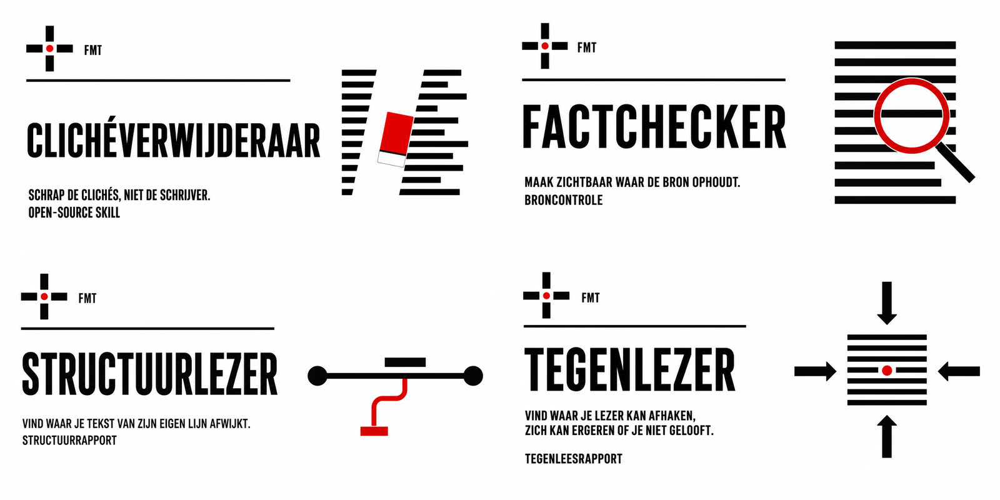

Onder de naam **Fast Moving Targets** help ik zelfstandigen, makers en kleine teams AI praktisch te gebruiken zonder zichzelf kwijt te raken.

Ik bouw tools, workflows en publicatie-omgevingen die helpen om beter te denken, onderzoeken, schrijven, kiezen en publiceren.

## FMT / BEGIN HIER

| Project | Wat je ermee kunt |
|---|---|
| [Open-source AI Skills NL](https://github.com/erwinblom/open-ai-skills-nl) | Gebruik negen Nederlandstalige skills voor redactie en innovatie. |
| [Link Bewaren](https://github.com/erwinblom/link-bewaren) | Bouw een persoonlijke bronnenbibliotheek met Chrome en Google Sheets. |
| [AI-OS Starterkit](https://github.com/erwinblom/ai-os-starterkit) | Geef AI vaste context over jezelf, je werk of je team. |
| [Maker Manuals](https://github.com/erwinblom/makermanuals) | Lees praktische handboeken over bouwen en werken met AI. |

## FMT / OPEN-SOURCE AI-SKILLS

**De Tekstploeg** helpt teksten onderzoeken en verbeteren met vier zelfstandige redactietools: Clichéverwijderaar, Factchecker, Structuurlezer en Tegenlezer.

**De Innovatieploeg** helpt organisaties van kans naar bewijs met vijf skills: Kansverkenner, Aannamejager, Klantverkenner, Eerste-versiebouwer en Bewijsweger.

[Bekijk alle negen skills, installatie-instructies en voorbeelden](https://github.com/erwinblom/open-ai-skills-nl)

## FMT / NIEUWSBRIEVEN

- [FMT Handpicked](https://fmthandpicked.substack.com) — media, communicatie en innovatie.
- [FMT Handpicked AI](https://fmthandpickedai.substack.com) — wat er verandert door AI en wat je ermee kunt.
- [Vibecoders Unite](https://vibecodersunite.substack.com) — zelf apps, sites en tools bouwen zonder technische kennis.

## FMT / OVER MIJ

Journalist van oorsprong. Sinds 1994 actief in internet, media en innovatie.

[Fast Moving Targets](https://www.fastmovingtargets.nl) · [LinkedIn](https://www.linkedin.com/in/erwinblom/)
